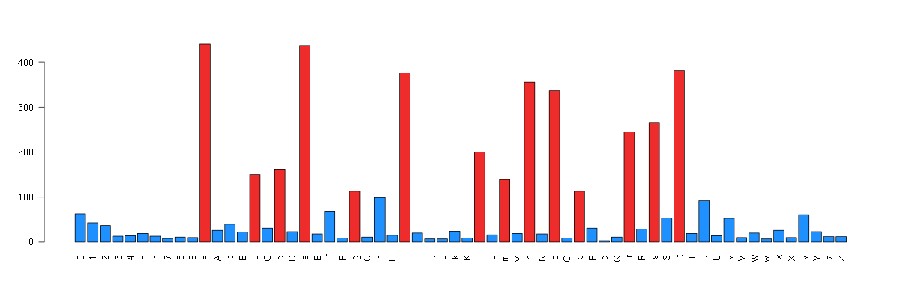

Q: Take the plaintext version of your resume (or linkedin profile) and create a bar chart of character frequency. (Bonus programmatically strip out punctuation and whitespace.) 

A: Use linux bash + R

Version Information

| Software | Version|
|:---------|:-------|
| sed   | GNU sed version 4.2.1 |
| awk   | GNU Awk 4.0.1 |
| sort  | sort (GNU coreutils) 8.15 |
| unique | sort (GNU coreutils) 8.15 |
| R | 3.2 |


```bash
echo "counts char" > cvdt1.log
sed 's/[^a-zA-Z0-9\s]//g' cv.txt | sed 's/\(.\)/\1\n/g' | sort | uniq -c > cvdt1.log
# delete missing 
awk '2d'<cvdt1.log > cvdt2.log
```
 This will give you the right frequency table, i.e.

| counts  | char  |
|:--------|:------|
|      63 | 0     |
|      43 | 1     |
|      37 | 2     |
|      13 | 3     |
|...| |

Hence we could draw the bar plot using GNU plot/R. For example, we use R bash mode to export the plot to pdf:

```bash
Rscript -e "pdf('re.pdf',width=14,height=4);dt = read.table('./cvdt2.log',header=T);counts = dt[,1];names(counts) = dt[,2];col=c('dodgerblue','firebrick2');barplot(counts,names.arg=dt[,2],las=2,col=col[1+(dt[,1]>100)]);dev.off()"
```

Result (in png as Github won't show pdf in markdown)


